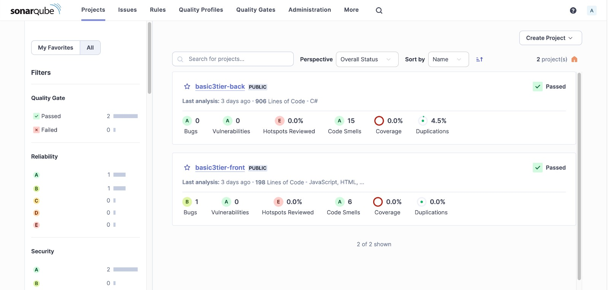

# Part 4 - Deploy the application on Azure Web Apps using the Azure DevOps pipeline 

## Steps:

### 1. Create two web apps under one app service plan: Use Terraform scripts to create these web apps
- Config. files:
```
part-4-webApps/
├── modules/
|   ├── app_service_plan/
|   |   ├── main.tf
|   |   ├── variables.tf
|   |   └── outputs.tf
|   └── web_app/
|       ├── main.tf
|       ├── variables.tf
|       └── outputs.tf
├── storage_account/
|   ├── main.tf
|   └── variables.tf
├── main.tf
├── variables.tf
├── outputs.tf
├── terraform.tfvars
├── backend.tf
├── postgresql.tf
├── README.md
└── pipelines/
    ├── azure-pipelines-back.yml
    └── azure-pipelines-front.yml
```
- Commands: 
```
$ terraform init
$ terraform plan
$ terraform apply

```

### 2. Create Azure DevOps pipelines to deploy code on Azure Web Apps 

- **Frontend Pipeline (Basic3Tier.UI)**
```
trigger:
- main

pool:
  vmImage: ubuntu-latest

steps:
    - task: ArchiveFiles@2
      inputs:
        rootFolderOrFile: '$(System.DefaultWorkingDirectory)'
        includeRootFolder: false
        archiveType: 'zip'
        archiveFile: '$(Build.ArtifactStagingDirectory)/$(Build.BuildId).zip'
        replaceExistingArchive: true


    - task: PublishBuildArtifacts@1
      inputs:
        PathtoPublish: '$(Build.ArtifactStagingDirectory)'
        ArtifactName: 'front'

    - task: AzureRmWebAppDeployment@4
      inputs:
        ConnectionType: 'AzureRM'
        azureSubscription: 'Ironhack Subs(2)(b892ab8c-2c38-478a-8b8b-887ddc61d17d)'
        appType: 'webAppLinux'
        WebAppName: 'the-frijoles-front' 
        packageForLinux: '$(Build.ArtifactStagingDirectory)/$(Build.BuildId).zip'
        StartupCommand: 'pm2 serve /home/site/wwwroot'
```
* Modified files: config.json
```
{
    "API_URL": "https://the-frijoles-back.azurewebsites.net/"
}
```


- **Backend Pipeline (Basic3Tier.API)**

```
trigger:
- main
pool:
  vmImage: 'ubuntu-latest'
steps:
- task: UseDotNet@2
  inputs:
    version: '7.x'
    includePreviewVersions: true
- task: DotNetCoreCLI@2
  displayName: Build
  inputs:
    command: build
    projects: '**/*.csproj'
    arguments: '--configuration $(buildConfiguration)' 
- task: DotNetCoreCLI@2
  inputs:
    command: test
    projects: '**/*Tests/*.csproj'
    arguments: '--configuration $(buildConfiguration)'
- task: DotNetCoreCLI@2
  inputs:
    command: publish
    publishWebProjects: True
    arguments: '--configuration $(BuildConfiguration) --output $(Build.ArtifactStagingDirectory)'
    zipAfterPublish: True
- task: AzureRmWebAppDeployment@4
  inputs:
    ConnectionType: 'AzureRM'
    azureSubscription: 'Ironhack Subs(2)(b892ab8c-2c38-478a-8b8b-887ddc61d17d)'
    appType: 'webAppLinux'
    WebAppName: 'the-frijoles-back'
    packageForLinux: '$(Build.ArtifactStagingDirectory)/**/*.zip'
    RuntimeStack: 'DOTNETCORE|7.0'
    StartupCommand: 'dotnet Basic3TierAPI.dll'

```
* Modified files: appsettings.json
```
{
  "AllowedHosts": "*",
  "ConnectionStrings": {
     "Basic3Tier": "Host=basic3tier.postgres.database.azure.com;Port=5432;Database=basic3tier;Username=postgres;Password=PASSWORD?"
  },
  "Logging": {
    "LogLevel": {
```

### 4. Include Sonarqube in your pipelines
- Add the connection for SonarQube in the pipeline
- In the VM, run a container with SonarQube: `docker run -d --name sonarqube -e SONAR_ES_BOOTSTRAP_CHECKS_DISABLE=true`  
-p 9000:9000 sonarqube:latest``
- Enable the Inbound connection for port 9000
- Access SonarQube with the IP and port: http://20.199.89.0:9000/




 

<!-- 

terraform plan -out webApp
terraform apply webApp

Run pipelines on dev.azure portal

Front pipeline:
trigger:
- main

pool:
  vmImage: ubuntu-latest

steps:
    - task: ArchiveFiles@2
      inputs:
        rootFolderOrFile: '$(System.DefaultWorkingDirectory)'
        includeRootFolder: false
        archiveType: 'zip'
        archiveFile: '$(Build.ArtifactStagingDirectory)/$(Build.BuildId).zip'
        replaceExistingArchive: true


    - task: PublishBuildArtifacts@1
      inputs:
        PathtoPublish: '$(Build.ArtifactStagingDirectory)'
        ArtifactName: 'front'

    - task: AzureRmWebAppDeployment@4
      inputs:
        ConnectionType: 'AzureRM'
        azureSubscription: 'Ironhack Subs(2)(b892ab8c-2c38-478a-8b8b-887ddc61d17d)'
        appType: 'webAppLinux'
        WebAppName: 'the-frijoles-front' 
        packageForLinux: '$(Build.ArtifactStagingDirectory)/$(Build.BuildId).zip'
        StartupCommand: 'pm2 serve /home/site/wwwroot'


Back pipeline:

trigger:
- main
pool:
  vmImage: 'ubuntu-latest'
steps:
- task: UseDotNet@2
  inputs:
    version: '7.x'
    includePreviewVersions: true
- task: DotNetCoreCLI@2
  displayName: Build
  inputs:
    command: build
    projects: '**/*.csproj'
    arguments: '--configuration $(buildConfiguration)' 
- task: DotNetCoreCLI@2
  inputs:
    command: test
    projects: '**/*Tests/*.csproj'
    arguments: '--configuration $(buildConfiguration)'
- task: DotNetCoreCLI@2
  inputs:
    command: publish
    publishWebProjects: True
    arguments: '--configuration $(BuildConfiguration) --output $(Build.ArtifactStagingDirectory)'
    zipAfterPublish: True
- task: AzureRmWebAppDeployment@4
  inputs:
    ConnectionType: 'AzureRM'
    azureSubscription: 'Ironhack Subs(2)(b892ab8c-2c38-478a-8b8b-887ddc61d17d)'
    appType: 'webAppLinux'
    WebAppName: 'the-frijoles-back'
    packageForLinux: '$(Build.ArtifactStagingDirectory)/**/*.zip'
    RuntimeStack: 'DOTNETCORE|7.0'
    StartupCommand: 'dotnet Basic3TierAPI.dll' -->
 
