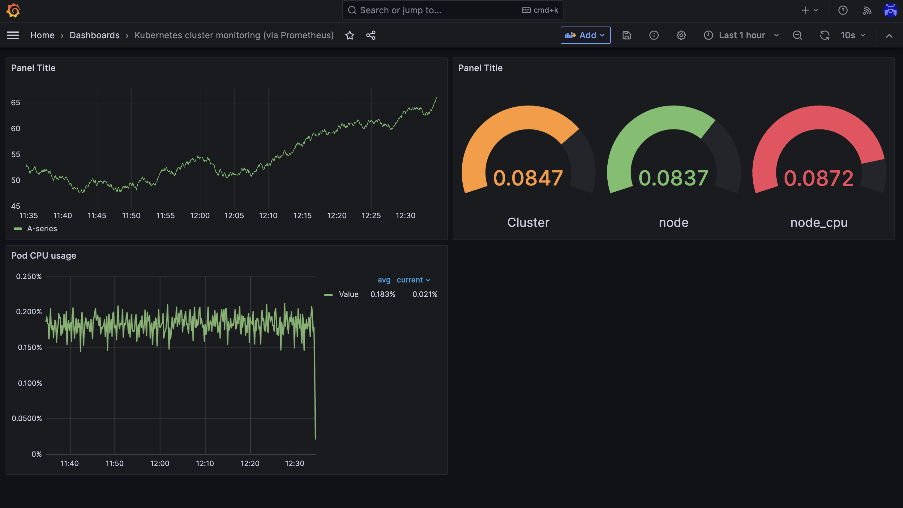

# Part 7 - Deploy and manage Prometheus and Grafana 


## Steps

 
### 1. Use Ansible playbooks to deploy Prometheus and Grafana on a Linux machine.
Prerequisites:
1. Ensure Ansible is installed on your local machine or a control node.
```
sudo apt install ansible
sudo apt-get install python3-docker
ansible-playbook all-playbooks.yml
```
2. Create an Ansible inventory file containing information about your target machines.
3. Create config files:
```
part-7-prometheus,grafana
|
├── Readme.md
├── all-playbooks.yml
├── ansible.cfg
├── hosts
├── install-grafana.yml
├── install-node-exporter.yml
├── install-prometheus.yml
├── prometheus-config/
    └── prometheus.yml
```
- Refer to the provided all-playbooks.yml file, which orchestrates the deployment by importing specific playbooks for Prometheus (install-prometheus.yml) and Grafana (install-grafana.yml).

- Exectution commands to run Ansible Playbooks:
```
$ ansible-playbook -i your_inventory_file deploy_prometheus.yml
$ ansible-playbook -i your_inventory_file deploy_grafana.yml
$ ansible-playbook -i your_inventory_file configure_prometheus.yml

```

### 2. Add the infrastructure metrics of all the VMs used in the project to the monitoring tool. 

- Add the infrastructure metrics of all VMs used in the project to the monitoring tool.
- Ensure that ports 9090 (Prometheus), 9100 (NodeExporter), and 3000 (Grafana) are allowed in network inbound rules.


### 3. Identify the key metrics you wish to monitor and create Dashboards in Grafana. You should be clear about why these metrics are important


### 4. Enable monitoring logs of AKS on managed Prometheus and Grafana 
Automate dashboard configuration using Grafana's API or manually import JSON dashboards.
- Configure Prometheus to Collect AKS Logs: Update the Prometheus configuration to include the necessary settings for scraping AKS logs
- Grafana Dashboards: Create Grafana dashboards that visualize the AKS logs. 

### 5. [Bonus] - Add the code application logs to the monitoring tool.

 